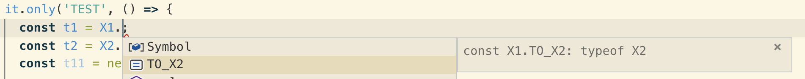

# How to Solve Cyclic Dependencies in VDM

In several cases, services can include entities linked to each other through a navigation property, hence raising cyclic dependency in the service module (e.g. `@sap/cloud-vdm-physical-inventory-doc-service`).

To incorporate the case, we have in this instance two entities **A** and **B**, that link to each other **A** <-> **B**.

To access to the entity constructor of **B** from **A**, we call:

```ts
const constructorOfB = A.STATIC_HELPER_OF_B.linkedEntity;
```

such as the static helper `STATIC_HELPER_OF_B` is defined in `A` as the following:

```ts
static STATIC_HELPER_OF_B = new OneToOneLink('LinkToB', A, B);
```

When we declare our service module, we call all these classes into `index.ts`, that determines indeed the **compiling order** of the transpiled javascript files.

In this instance, if `index.ts` is:

```ts
import '*' from './B';
import '*' from './A';
```

We can access **A** **from** **B**, but we the inverse yields **B** `undefined` in **A**.
For more information see [wikipedia](https://en.wikipedia.org/wiki/Circular_dependency).

## How ot solve this on application level

To rescue to this behavior, as **a workaround**, a proposed solution as a fix for the undefined linked properties is to import the failing class by specifying its original path in the module. In usual case we import modules elements from the `index.js` file by calling `import { PhysInventoryDocItem } from @sap/cloud-vdm-physical-inventory-doc-service`. To dodge the deterministic compilation decided by `index.ts`, it can be fixed by calling while importing the class by:

```ts
import { PhysInventoryDocItem } from @sap/cloud-vdm-physical-inventory-doc-service/PhysInventoryDocItem
```

to fix the undefined entity, when it occurs.

However, due to the `static` constraint in the pregenerated client's class definitions, the suggested fix to integrate both cyclic classes in a single file and the method described in the tutorial proposed in this [medium post](https://medium.com/visual-development/how-to-fix-nasty-circular-dependency-issues-once-and-for-all-in-javascript-typescript-a04c987cf0de) won't work unfortunately.

## Solution proposal #1

A possible solution that can be integrated in core/vdm and fix this issue is to provide a **getter** to external classes inside classes susceptible to be in a cyclic dependency. The getter in this case checks whether the **linked class** of the entity is defined (or loaded by the compiler):

- If so, returns normally the class (which is basically an entity constructor).
- Otherwise, the getter returns the entire **module** where the class is defined. As an example, if class A is defined in file `ClassA.ts`, we load the module `ClassA` using the keyword `import module = require('ClassA')` which hold basically all exported element in `ClassA.ts` and return it afterward.

By returning the module inside the static navigation property, we need thus a further processing in `sdk-core` level, to extract the concrete entity constructor of the linked entity from the module.

Bellow is a minimal example implemented in **physical-inventory-doc-service**:

```ts
// PhysInventoryDocItem.ts

import { PhysInventoryDocHeader } from './PhysInventoryDocHeader';
import helper = require('./PhysInventoryDocHeader');

export class PhysInventoryDocItem
  extends Entity
  implements PhysInventoryDocItemType
{
  static getPhysInventoryDocHeader(): any {
    if (!PhysInventoryDocHeader) {
      console.log('Header is undefined in Item.');
      return helper;
    }
    return PhysInventoryDocHeader;
  }

  static TO_PHYSICAL_INVENTORY_DOCUMENT: OneToOneLink<
    PhysInventoryDocItem,
    PhysInventoryDocHeader
  > = new OneToOneLink(
    'to_PhysicalInventoryDocument',
    PhysInventoryDocItem,
    PhysInventoryDocItem.getPhysInventoryDocHeader()
  );
}

// PhysInventoryDocHeader.ts

import { PhysInventoryDocItem } from './PhysInventoryDocItem';
import helper = require('./PhysInventoryDocItem');

export class PhysInventoryDocHeader
  extends Entity
  implements PhysInventoryDocHeaderType
{
  static getPhysInventoryDocItem(): any {
    if (!PhysInventoryDocItem) {
      console.log('Item is undefined in Header.');
      return helper;
    }
    return PhysInventoryDocItem;
  }

  static TO_PHYSICAL_INVENTORY_DOCUMENT_ITEM: Link<
    PhysInventoryDocHeader,
    PhysInventoryDocItem
  > = new Link(
    'to_PhysicalInventoryDocumentItem',
    PhysInventoryDocHeader,
    PhysInventoryDocHeader.getPhysInventoryDocItem()
  );
}
```

It is important here to consider that we return here the **module** rather than the entity constructor, which is not extractable from the module helper **inside the entity scope** due to the cyclic dependency issue. Therefore, in de-serialization, we need an extra case differentiation on linked entity navigation property (and eventually an entity constructor extractor) to parse the exact entity constructor and store it in `.linkedEntity` property.

Bellow a fulfilled integration test, when the above example is implemented:

```ts
import {
  PhysInventoryDocHeader,
  PhysInventoryDocItem
} from '../../vdm/physical-inventory-doc-service/dist';

describe.only('Cyclic Dependency', () => {
  it.only('Should not be undefined: ', () => {
    const fromHeader =
      PhysInventoryDocHeader.TO_PHYSICAL_INVENTORY_DOCUMENT_ITEM.linkedEntity;
    const fromItem = PhysInventoryDocItem.TO_PHYSICAL_INVENTORY_DOCUMENT
      .linkedEntity as any;
    console.log('Show linked header from Item: ', fromHeader);
    console.log(
      'Show linked Item from Header: ',
      fromItem['PhysInventoryDocHeader']
    );
    expect(fromItem['PhysInventoryDocHeader']).to.deep.equal(
      PhysInventoryDocHeader
    );
    expect(fromHeader).to.deep.equal(PhysInventoryDocItem);
  });
});
```

Comment:

Although the provided fix is considered as a ~~hacky~~ work-around to the native JavaScript compilation behavior, it is to mention that it provides a solution that can be integrated on both generator and core to ensure the smoothness of de-serialization by entities participating in such cyclic dependency. The firstly provided work-around, however, can be implemented only on application level.

## Solution proposal #2

This can also be solved by declaration merging of a class and a namespace. By separating the static content to a namespace and importing the cyclic dependency only after a class was declared, the issue can also be resolved:

```ts
export class X1 {
  test = 'X1';
}

import { X2 } from './class-x2';

export namespace X1 {
  export const TO_X2 = X2;
}
```

The downside is that the "static" properties are now variables and look different in the IDE:


Decision: go with solution #2
