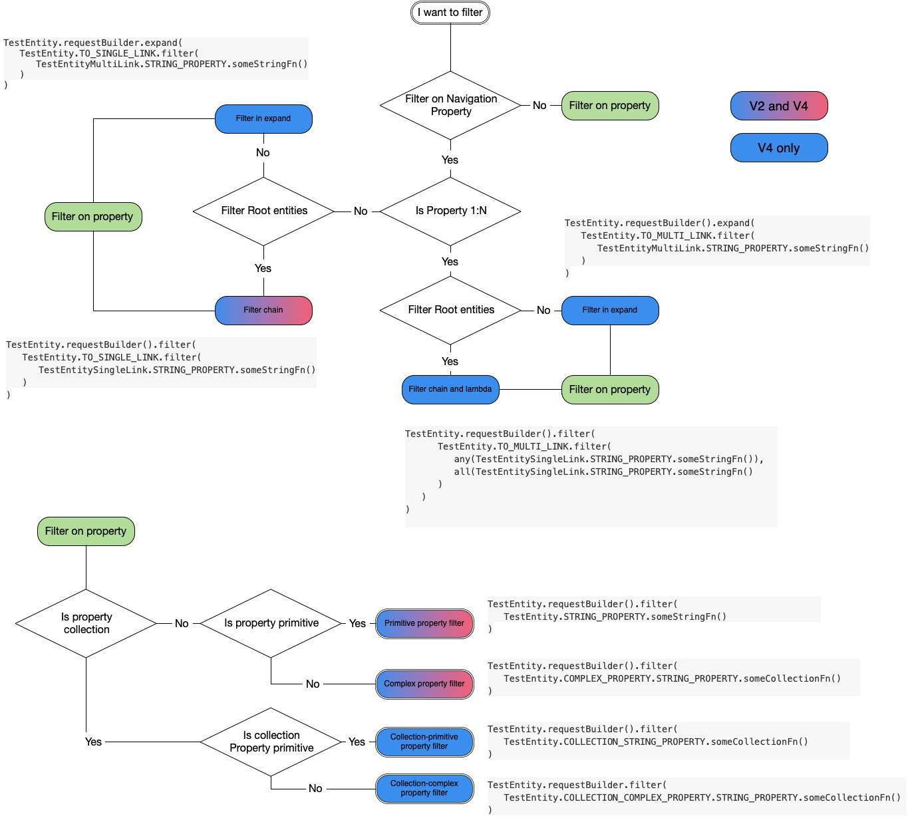

# API Proposal: OData v4 (killer) features

This document contains a collection of OData v4 features we want to implement and according API proposals.

## Collections and Complex Types

- Complex Types - _already available in v2_
  - SDK representation: JS objects (with some sugar)
- Collection types - _new in v4_
  - List of primitive or complex types
  - Navigation properties can also be represented as collections (one-to-many)
  - Example property in EDMX: `<Property Name="Emails" Type="Collection(Edm.String)" />`
  - Example values: https://services.odata.org/TripPinRESTierService/(S(ljgcbxqwp45c5l5m0h24kk1g))/People?$select=Emails

### Proposal(s)

- Represent as arrays for primitive types (e. g. `string[]` for the example above)

### Decision

- Proposal accepted.

## $expand with Subqueries

- Make queries on expanded entities (navigation properties and complex properties)
- Works for `getAll` and `getByKey`
- Example request for one to many link: https://services.odata.org/TripPinRESTierService/(S(ljgcbxqwp45c5l5m0h24kk1g))/People?$select=Friends&$expand=Friends($select=UserName,Emails;$filter=startswith(UserName,%27s%27))
- Example request for one to one link: https://services.odata.org/TripPinRESTierService/(S(ljgcbxqwp45c5l5m0h24kk1g))/People?$select=BestFriend&$expand=BestFriend($select=UserName,Emails)
- Could not find a working example for complex types

### Questions

- Query options related to lists should be used on one-to-many navigation properties only? (This is not failing in the reference services)
- Is v4 behavior that when expanding, all properties of the navigation property are selected?

### Proposal(s)

- Allow all query operations within a select on collection types. For non-collection types this is already possible.

  ```ts
  TestEntity.requestBuilder()
    .getAll()
    .select(
      TestEntity.TO_SINGLE_LINK.select(TestEntitySingleLink.STRING_PROPERTY),
      TestEntity.TO_MULTI_LINK.select(
        TestEntityMultiLink.STRING_PROPERTY,
        TestEntityMultiLink.BOOLEAN_PROPERTY
      )
        .filter(
          TestEntityMultiLink.STRING_PROPERTY.equals('test'),
          TestEntityMultiLink.BOOLEAN_PROPERTY.equals(true)
        )
        .orderBy(desc(TestEntityMultiLink.STRING_PROPERTY))
        .skip(1)
        .top(10)
        .search('term')
    );
  ```

- Allow all query operations within an additional expand on collection types. For non-collection types this is already possible.
  - Consider whether expand should also be available in v2 API.
  ```ts
  TestEntity.requestBuilder()
    .getAll()
    .expand(
      TestEntity.TO_SINGLE_LINK.select(TestEntitySingleLink.STRING_PROPERTY),
      TestEntity.TO_MULTI_LINK.select(
        TestEntityMultiLink.STRING_PROPERTY,
        TestEntityMultiLink.BOOLEAN_PROPERTY
      )
        .filter(
          TestEntityMultiLink.STRING_PROPERTY.equals('test'),
          TestEntityMultiLink.BOOLEAN_PROPERTY.equals(true)
        )
        .orderBy(desc(TestEntityMultiLink.STRING_PROPERTY))
        .skip(1)
        .top(10)
        .search('term')
    );
  ```

### Decision:

- Second proposal accepted. Our assumption that expanding navigation properties automatically selects all properties of the navigation property has proven correct.

## $select with Subqueries

- Can only be used for complex types and collection types, not for navigation properties
- Couldn't find a working example, assuming the following are valid examples:
  - Selection within complex type (does not work): https://services.odata.org/TripPinRESTierService/(S(ljgcbxqwp45c5l5m0h24kk1g))/Airports?$select=Location($select=Address)
  - Filter within collection complex type (does not work): https://services.odata.org/TripPinRESTierService/(S(ljgcbxqwp45c5l5m0h24kk1g))/People?$select=AddressInfo($filter=Address%20eq%20%27187%20Suffolk%20Ln.%27)

### Questions

- How does this feature really work?
- Where can we test this?
- Can we use a CAP service to test this?

### Proposal(s)

- This proposal is incomplete due to a lack of information on how the sub select actually works

  Single Complex Type

  ```ts
  TestEntity.requestBuilder().getAll().select(
    TestEntity.COMPLEX_TYPE_PROPERTY.select(
      TestComplexType.BOOLEAN_PROPERTY,
      TestComplexType.STRING_PROPERTY
    ) // allow selection of complex type properties
  );
  ```

  Collection Complex Type

  ```ts
  TestEntity.requestBuilder()
    .getAll()
    .select(
      TestEntity.COMPLEX_TYPE_COLLECTION_PROPERTY.select(
        TestComplexType.BOOLEAN_PROPERTY,
        TestComplexType.STRING_PROPERTY
      ).filter(TestComplexType.STRING_PROPERTY.equals('test'))
      // ... allow all other query operations on collections
    );
  ```

### Decision

- Proposal accepted so far, but a final decision can only be made once we can test the feature.

## Filtering the Root Collection by Filters on One-To-One Links

- One-To-One Links:

  - v2 example:
    https://services.odata.org/V2/Northwind/Northwind.svc/Products?$select=Category/CategoryID&$expand=Category&$filter=Category/CategoryID%20eq%202

  - v4 example:
    https://services.odata.org/Experimental/Northwind/Northwind.svc/Products?$select=Category&$expand=Category($select=CategoryID)&$filter=Category/CategoryID%20eq%202

### Proposal(s)

- Same approach as v2

  ```ts
  TestEntity.requestBuilder()
    .getAll()
    .filter(
      TestEntity.TO_SINGLE_LINK.filter(
        TestEntitySingleLink.TO_SINGLE_LINK.filter(
          WhateverTheName.STRING_PROPERTY.equals('test'),
          WhateverTheName.STRING_PROPERTY.notEquals('fest')
        )
      )
    );
  ```

  The second use of `filter` is misleading, we might want ot find a better keyword

- Direct chaining
  ```ts
  TestEntity.requestBuilder()
    .getAll()
    .filter(
      TestEntity.TO_SINGLE_LINK.TO_SINGLE_LINK.STRING_PROPERTY.equals('test'),
      TestEntity.TO_SINGLE_LINK.TO_SINGLE_LINK.STRING_PROPERTY.notEquals('fest')
    );
  ```

### Decision

- We will go with the first approach for now, but consider the second approach for SDK 2.0. The second option would most likely require us to change our API altogether, which might be valid for an SDK 2.0. A decision like this should probably also be supported by a user study.

## Filtering the Root Collection by Lambda functions for One-To-Many Links

- Keywords: `any` and `all`, evaluate filter expressions that hold true for at least one (or for all) entities in a navigation property
- Example query: https://services.odata.org/TripPinRESTierService/(S(ljgcbxqwp45c5l5m0h24kk1g))/People?$select=Friends&$expand=Friends($select=UserName)&$filter=Friends/any(d:d/UserName%20eq%20%27scottketchum%27)

### Proposal(s)

```ts
TestEntity.requestBuilder()
  .getAll()
  .filter(
    TestEntity.TO_MULTI_LINK.filter(
      any(TestEntitySingleLink.STRING_PROPERTY.equals('test')),
      all(TestEntitySingleLink.STRING_PROPERTY.notEquals('fest'))
    )
  );
```

### Decision

- Proposal accepted.

Here some flow on the actual filter possibilities and in which version they are implemented.
The possible filter functions will depend on the data type. For example a string type will offer different conditions than a boolean or collection.


## Type dependent filter expressions (e. g. 'year' for dates)

- Already available in v2 for the most part, there are some more functions
- Recap filter functions in v2:
  ```ts
  TestEntity.requestBuilder().getAll().filter(
    length(TestEntity.STRING_PROPERTY).equals(3), // specific function
    filterFunction('length', 'int', TestEntity.STRING_PROPERTY).equals(3) // generic function
  );
  ```
  - => yields $filter=length(StringProperty) eq 3

### Proposal(s)

- Reuse filter functions from v2
- Provide more default implementations for both v2 / v4

### Decision

- Proposal accepted.

## Deep update of child entities

### odata v4.0 V.S. odata v4.0.1

#### odata v4.0

- only support binding info for navigation property
  1. [1-to-1] replace the existing one `object.set()`
  1. [1-to-n] add them to the existing collection `collection.addAll()`

#### odata v4.0.1

- full set by using the same navigation property name `object.set()`, which does NOT allow:
  - adding links
  - deleting links
  - deleting entities
    because it replaces the existing data with the payload.

```json
{
  "@type": "#Northwind.Manager",
  "FirstName": "Patricia",
  "DirectReports": [
    {
      "@id": "Employees(5}"
    },
    {
      "@id": "Employees(6}",
      "LastName": "Smith"
    },
    {
      "FirstName": "Suzanne",
      "LastName": "Brown"
    }
  ]
}
```

- delta update by using a `@delta` annotation
  - delete entities (`@removed`)
  - delete links (`reason = deleted`)
  - add links (with id/key)
  - update entities (with id/key + Partial<Entity>)
  - create new entities + add links (without id/key)

```json
{
  "@type": "#Northwind.Manager",
  "FirstName": "Patricia",
  "DirectReports@delta": [
    {
      "@removed": {
        "reason": "deleted"
      },
      "@id": "Employees(3)"
    },
    {
      "@removed": {
        "reason": "changed"
      },
      "@id": "Employees(4)"
    },
    {
      "@id": "Employees(5)"
    },
    {
      "@id": "Employees(6)",
      "LastName": "Smith"
    },
    {
      "FirstName": "Suzanne",
      "LastName": "Brown"
    }
  ]
}
```

### Proposal(s)

#### Full set

- like deep create
- no api changes, only behavior changes
- be aware of the `@id` field that needs to be handled

  - [chosen] add `@id` attribute implicitly in the request builder (Java)
  - [interesting][optional] change navigation property type to e.g., :

  ```
  toOtherMultiLink: (TestEntityOtherMultiLink & Identifiable)[];

  interface Identifiable{
      _id: string
  }
  ```

  - hint: `@id` is used [here](http://docs.oasis-open.org/odata/odata/v4.01/odata-v4.01-part1-protocol.html#sec_LinktoRelatedEntitiesWhenCreatinganE)

```typescript
const singleLink = getSingleLinkFromSystem();
singleLink.stringProperty = 'new value';

const entity = TestEntity.builder().toSingleLink(singleLink).build();

new UpdateRequestBuilder(TestEntity, entity).execute(destination);
```

#### Delta update

```typescript
    new UpdateRequestBuilder(TestEntity, entity)
      .deepUpdateWithDeltaPayload(
      TestEntity.TO_MULTI_LINK, deltaMultiLink1, deltaMultiLink2
    ).deepUpdateWithDeltaPayload(
      someOtherNavigationProperty...
    )
    .execute(destination);
```

```
deltaMultiLink: TestEntityMultiLink & IsRemoved;

interface IsRemoved{
    removed?: boolean;
    reason?: string;
}
```

Again, `@id` can be treated the same way as the full set

### Decision

#### 4.0 V.S. 4.0.1

We stick to version `4.0.1`, since it's newer, the latest and more powerful.
Also, this [link](http://docs.oasis-open.org/odata/new-in-odata/v4.01/cn01/new-in-odata-v4.01-cn01.html#_Toc485385071)
indicates that 4.0.1 introduces deep updates.

### Scope

We will do the the implementation of the `full set` and not the delta since there is no test system to support it.

- Full set (Y)
- @delta (N)
  - @delete (N)
    - reason (N)
  - with id/key (N)
  - without id/key (N)

### Priority

Relatively low

- No test system
- No feature request

# Additional Features aka. Nice to haves

## $search

- New query operator allows to search all columns by value
- Can consist of terms, phrases and groups and logical operators, e.g. `$search=term AND NOT "phrase expression" OR (group expression)
- No working examples found, TripPin does not fail at least: https://services.odata.org/TripPinRESTierService/(S(ljgcbxqwp45c5l5m0h24kk1g))/People?$search=Female

### Questions

- Where to get a service that supports that?

### Proposal(s)

- Plain string for terms, phrase and group expressions

  ```ts
  .search('term')
  .search('"phrase expression"')
  .search('(group expression)')
  ```

  Conjunctions

  ```ts
  .search(and('term', 'otherterm')) // $search=term AND otherterm
  .search('term', 'otherterm') // $search=term AND otherterm
  .search(or('term', 'otherterm')) // $search=term OR otherterm
  .search(not('term')) // $search=NOT term
  .search(not('term', 'otherterm')) // $search=NOT (term AND otherterm)
  ```

### Decision

- Proposal accepted, but only nice to have.

## Enum types

- Enumerations of constant values in OData
- EDMX example:
  ```xml
  <EnumType Name="PersonGender">
    <Member Name="Male" Value="0" />
    <Member Name="Female" Value="1" />
    <Member Name="Unknown" Value="2" />
  </EnumType>
  ```

### Proposal(s)

- Use enums
  ```ts
  enum PersonGender {
    Male = '0',
    Female = '1',
    Unknown = '2'
  }
  ```

### Decision

- TBD

## Actions

- Like Functions but can have side effects, while functions must not

### Proposal(s)

- Same approach as for functions
- Rename functions from function-imports to functions

### Decision

- TBD

## Other Features

- Singletons
- Bound Operations (actions and functions)
- create entities + add links
  - It seems that the sdk v2 api already supports such operation.
    But for both s4 business partner and [this reference service](<https://services.odata.org/V2/(S(readwrite))/OData/OData.svc/>),
    it's not easy to test whether our existing v2 api support such operation, because the children entities cannot be created as orphan entities.
    Without orphan entities, one cannot create a parent entity and link the parent to some children.
