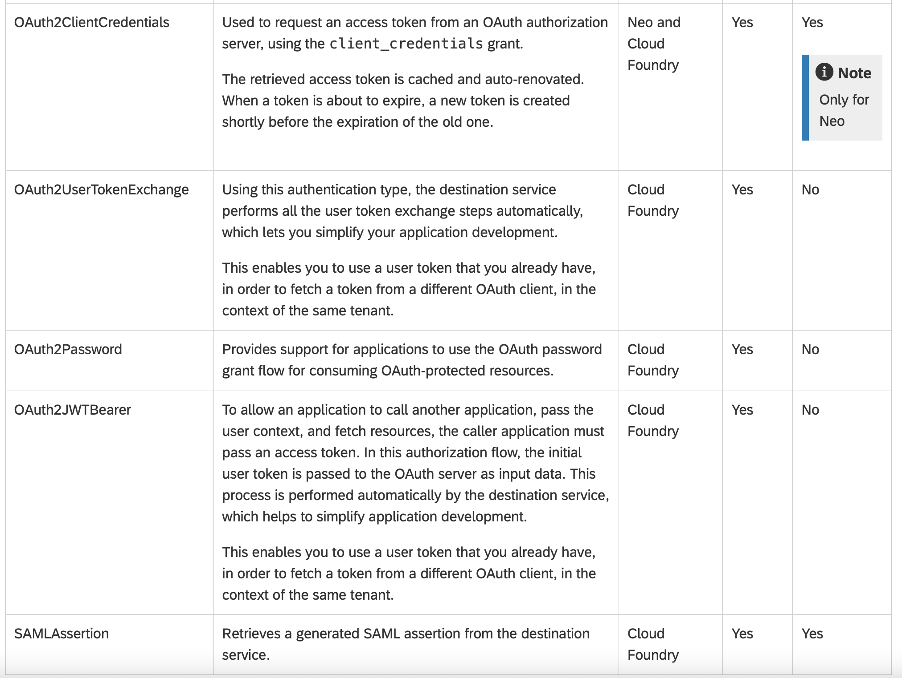

# SAP BTP Destination type

The screenshot below shows the authentication type of destination on SAP BTP, where On-Premise proxy supports limited authentication types.

See original BTP doc [here](https://help.sap.com/products/BTP/df50977d8bfa4c9a8a063ddb37113c43/765423ddb66147bc8141607a8522fe65.html?locale=en-US).
