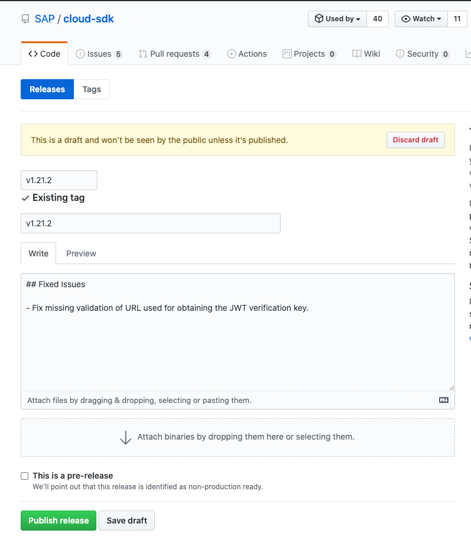

# Release Process

All SAP Cloud SDK modules will be published with the same version regardless whether there were changes within the particular packages or not.

## Preparations for a Release

- Make sure the internal e2e tests are green based on the latest version of the SDK core.
- Make sure there is no unchecked [dependabot findings](https://github.com/SAP/cloud-sdk-js/security/dependabot)
- Ensure that the changelog is up-to-date and correct.

## TLDR;
- run `bump.yml` workflow
- publish draft release
- merge API docs PR

## How to Bump a Version

The release process can only be triggered by owners of the repository.
If you are not in the owner list, you will not be able to proceed.

Releases are triggered by bumping the version using `pnpm version`.
We have a github [workflow](https://github.com/SAP/cloud-sdk-js/actions/workflows/bump.yml?query=workflow%3Abump) to do this.

Depending on the version you want to release, choose:

- `main`, as default value, for a current version release
- e.g. `1.0-main`, for version 1 release

To trigger it, press "Run workflow".

This will create a version tag (e. g. `v1.18.0`), which in turn creates a Github release draft.
The name of the release will be the name of the tag.

## How to Trigger a Release

The information from the changesets is automatically copied as description for the draft.
If you are not happy with this, adjust the release notes on this tag, but keep in mind to also update the RELEASE_NOTES.md.

Once all checks have passed, you can publish the release by pressing the green "Publish" button.
This will trigger the release pipeline, that publishes all modules to npm.

## How to Update API Docs

An API docs PR will be automatically created in https://github.com/SAP/cloud-sdk.
Make sure to merge it. 

### What to do When the Build Fails

You should only trigger a release, when the last build on the main branch succeeded.
If the pipeline still fails for some reason, remove the tag on Github (and locally if you pulled it) and revert the bump commit, before fixing the issue.
Once the issue is fixed, retry.
