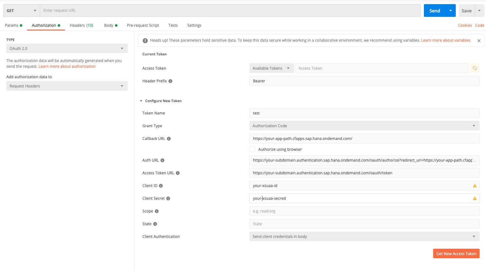

# Local OAuth flow Tests

The E2E tests in [auth-flows](../../test-packages/integration-tests/test/auth-flows) will test different auth flows of the destination services E2E.
The tests are not included in the pipeline and are commented out per default.
The purpose of these tests is the convenience to debug auth flows locally within the code repo.

Our nightly E2E tests cover auth flows as well, but to execute flows quickly and locally is an advantage.
You need to maintain some data explained in the next chapter to make the tests runs.

There is a recoding available where the steps to get all information is explained:

https://web.microsoftstream.com/video/c55e627b-16e9-463d-8c5f-3014db69596f

## Application

You need an application with service bindings to the `destination` and `workflow` service.
The application should be protected by an `XSUAA`.
The account where this is application runs is the `provider` account and you will need the subdomain of this account.

If you want to test the multi tenancy destination lookup, the app must be available via the service broker in other accounts.
You need a `subscriber` account in which you subscribed to the application mentioned above.
Internal developers may use the accounts used in our nightly E2E tests.

## Files to Create

Create all the files listed below next to the [auth-flow.spec.ts](../../test-packages/integration-tests/test/auth-flows/auth-flow.spec.ts)

### UserAccessTokens

Create a file `user-access-token.json` containing JWTs issued for the subscriber and provider account.
The format of the JSON is given by the `UserAccessTokens` type defined in [auth-flow-util.ts](../../test-packages/integration-tests/test/auth-flows/auth-flow-util.ts).

An easy way to get the tokens is to use postman with the following input:

- `Callback URL`: Path to the application protected by the XSUAA
- `Auth URL`: Path to the authentication endpoint using the provider or subscriber subdomain and the values for the callback url e.g. `https://<subdomain>.authentication.sap.hana.ondemand.com/oauth/authorize?redirect_uri=<redirectURL>`
- `Token URL`: Path to the token endpoint using the provider or subscriber subdomain e.g. https://<subdomain>.authentication.sap.hana.ondemand.com/oauth/token`
- `Client ID` and `Client secret` from the XSUAA (either VCAP variables or service keys)
- Do not check the `Authorize using browser checkbox`
- Cookies will remember the user name and password entered in the IdP login form which makes fetching new tokens super quick.
  Remove the cookies to re-enter the values.

Once you press the `Get new Access Token` you will be redirected to the login page and you enter the user and password.
Postman will show you the token after successful login flow.
For details on token retrieval have a look [here](https://sap.github.io/cloud-sdk/docs/java/guides/cloud-foundry-xsuaa-service/#scp-cf-xsuaa-key-use-cases).

### VCAP variables

Create a file `vcap-services.json` containing the VCAP variables of an application with services bindings to the `destination` and `workflow` service.

### Systems

Create a `systems.json` containing the destination names in the provider and subscriber account.
The format of this JSON is given by the `Systems` type defined in [oauth-flow-util.ts](../../test-packages/integration-tests/test/auth-flows/auth-flow-util.ts)
Internal developers can use the existing destinations of the E2E test landscape.

## Running the Tests

Once you created the relevant files, you can run the tests to execute auth flows locally.
