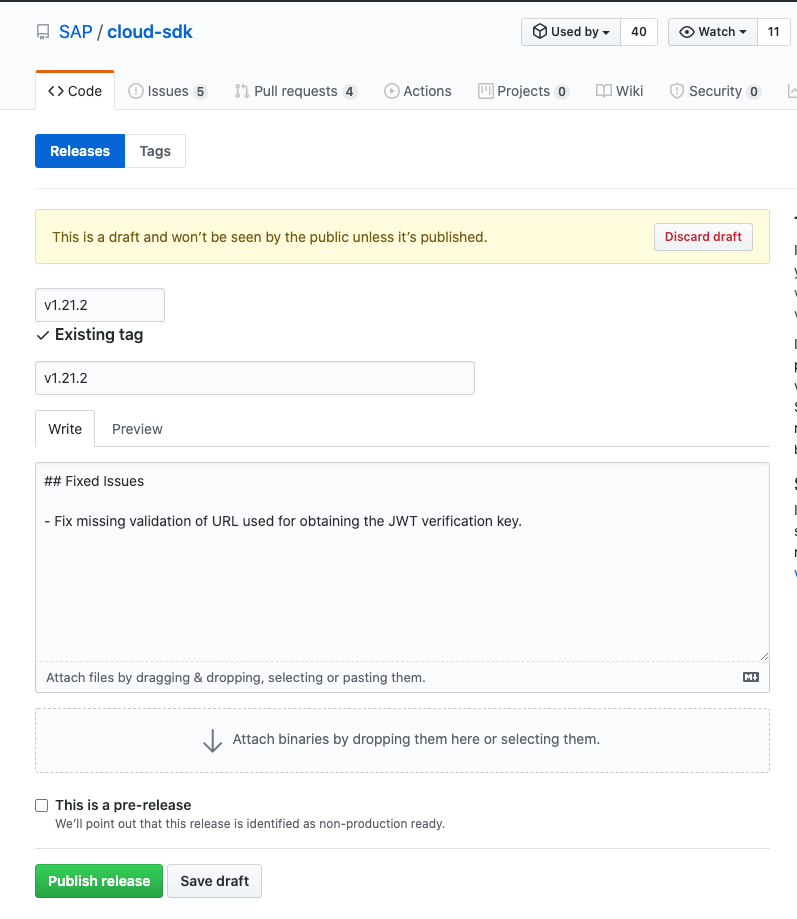

# Release Process
All SAP Cloud SDK modules will be published with the same version regardless whether there were changes within the particular packages or not.

## Preparations for a Release

Sometimes external libraries introduce breaking changing in minor version options.
In order to ensure that the SDK works with the current versions of external libraries run `yarn install` to update the `yarn.lock`.
If changes are there commit them to the main branch before releasing.

## How to trigger a release
The release process can only be triggered by owners of the repository.
If you are not in the owner list you will receive errors that the main branch is protected.

It is triggered by bumping the version using `lerna`. For convenience we added two scripts for patch and minor version bumps (`bump:patch` and `bump:minor`).
Running one of those commands will increase the version and commit this change to the main branch. It will also create a version tag (e. g. `v1.18.0`), which in turn triggers a build to run.
If this run is successful a Github release will be drafted. The name of the release will be the name of the tag.

The information from the CHANGELOG.md is automatically copied as description for the draft.
If you are not happy with this, adjust the release notes on this tag.

 When you decide that you are ready for releasing, publish the release by pressing the green button.
 This will trigger the release pipeline, that publishes all modules to npm.

 As a last follow-up task you can adjust the value for the release date in the CHANGELOG.md and if you already have the link to the blog post as well.

### What to do when the build fails
You should only trigger a release, when the last build on the main branch succeeded. If the pipeline still fails for some reason, remove the tag locally and on Github, before fixing the issue.
Once the issue is fixed, you will have to create a tag manually. Creating the tag should trigger the process as described above.
