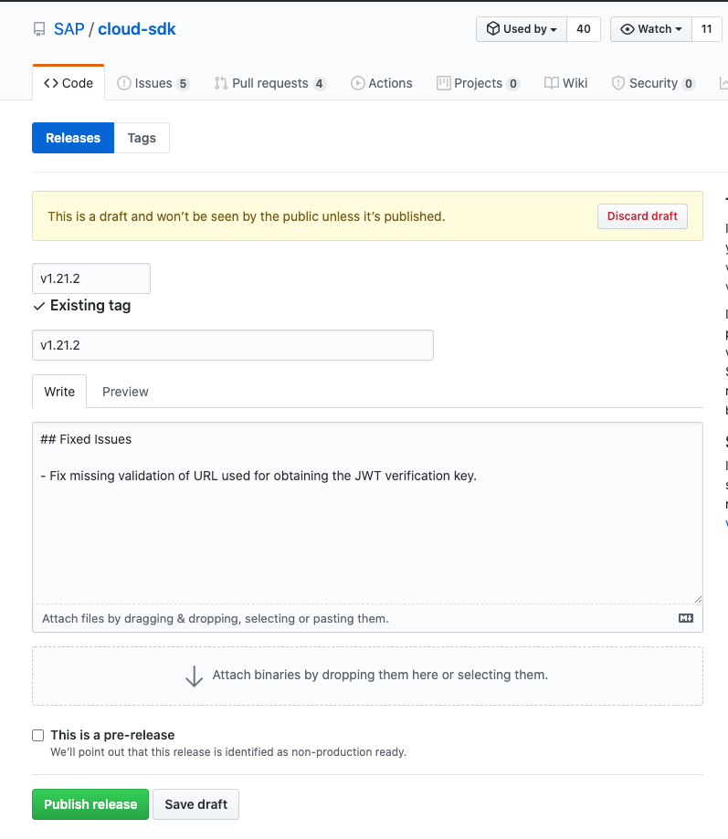

# Release Process

All SAP Cloud SDK modules will be published with the same version regardless whether there were changes within the particular packages or not.

## Preparations for a Release

- Make sure the internal e2e tests are green based on the latest version of the SDK core.
- Make sure there is no unchecked [depandabot findings](https://github.com/SAP/cloud-sdk-js/security/dependabot)
- Ensure that the changelog is up to date and correct.
  - Move up high priority changes, so that they are easier to spot.

## How to bump a version

The release process can only be triggered by owners of the repository.
If you are not in the owner list you will not be able to proceed.

Releases are triggered by bumping the version using `lerna`.
We have a github [workflow](https://github.com/sap/cloud-sdk-js/actions?query=workflow%3Abump) to do this.
To trigger it, press "Run workflow" and enter "patch" or "minor" depending which version increase you want to have.
This will create a version tag (e. g. `v1.18.0`), which in turn triggers the build workflow.
If the build is successful a Github release will be drafted.
The name of the release will be the name of the tag.

## How to trigger a release

The information from the CHANGELOG.md is automatically copied as description for the draft.
If you are not happy with this, adjust the release notes on this tag, but keep in mind to also update the CHANGELOG.md.

Once all checks have passed, you can publish the release by pressing the green "Publish" button.
This will trigger the release pipeline, that publishes all modules to npm.

As a last follow-up task you can adjust the value for the release date in the CHANGELOG.md and if you already have the link to the blog post as well.

### What to do when the build fails

You should only trigger a release, when the last build on the main branch succeeded.
If the pipeline still fails for some reason, remove the tag on Github (and locally if you pulled it), before fixing the issue.
Once the issue is fixed, you will have to create a tag manually.
Creating the tag should trigger the process as described above.
