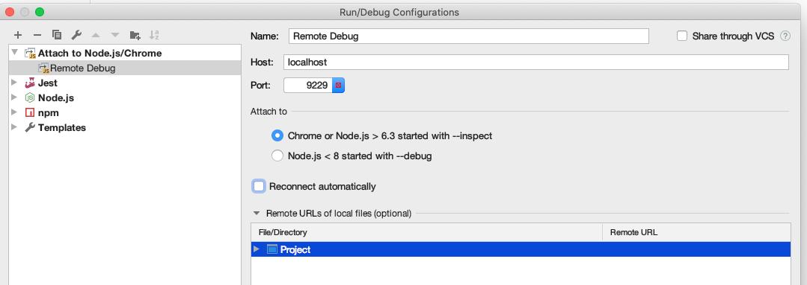

# How to remote debug an application on SAP Cloud Platform

## TLDR;

Change your app to start in debug mode, ssh tunnel your local port 9229 to the remote port of 9229 of your application and start a remote debugging session from your IDE.

## Steps

### Assign yourself as a Space Developer.

1. Go to the space on CF where your application will be pushed to.
2. Click `Member` on the left side.
3. Add yourself as a `Space Developer`.

### Deploy your application with debug mode

Replace the start script to run in debug mode.
E. g. instead of `node start.js` use `node --inspect start.js` for node and instead of `ts-node start.ts` use `node -r ts-node/register --inspect start.ts`.
You can do this by either changing your `start` script in the `package.json` or the `command` script in the `manifest.yml`.
**Note:** Don't use `--inspect-brk`, this will make the start timeout on SAP Cloud Platform.

Deploy your application as usual, run:

```shell
cf deploy
```

### Open an ssh tunnel to your application

Open an ssh tunnel to your backend application to connect your local debugger with the node inspector running on port 9229.
Replace _<your-app-name>_ with your application name and run:

```shell
$ cf ssh <your-app-name> -L 9229:127.0.0.1:9229 -T -N
```

### Attach a local debugger

Now you can attach your local debugger.
For this you will have to launch a debugger that attaches to the remote session.

#### Visual Studio Code

In Visual Studio Code this is a launch configuration you can use, when you replace _<path-to-your-application>_ with the relative path to your application directory:

```json
{
  "version": "0.2.0",
  "configurations": [
    {
      "type": "node",
      "request": "attach",
      "name": "Attach to Remote",
      "address": "127.0.0.1",
      "port": 9229,
      "localRoot": "${workspaceFolder}/<path-to-your-application>",
      "remoteRoot": "/home/vcap/app",
      "skipFiles": ["<node_internals>/**"]
    }
  ]
}
```

#### Webstorm

In Webstorm you can add configure debugging by creating a config as shown below:



Start the debugger and happy debugging!
