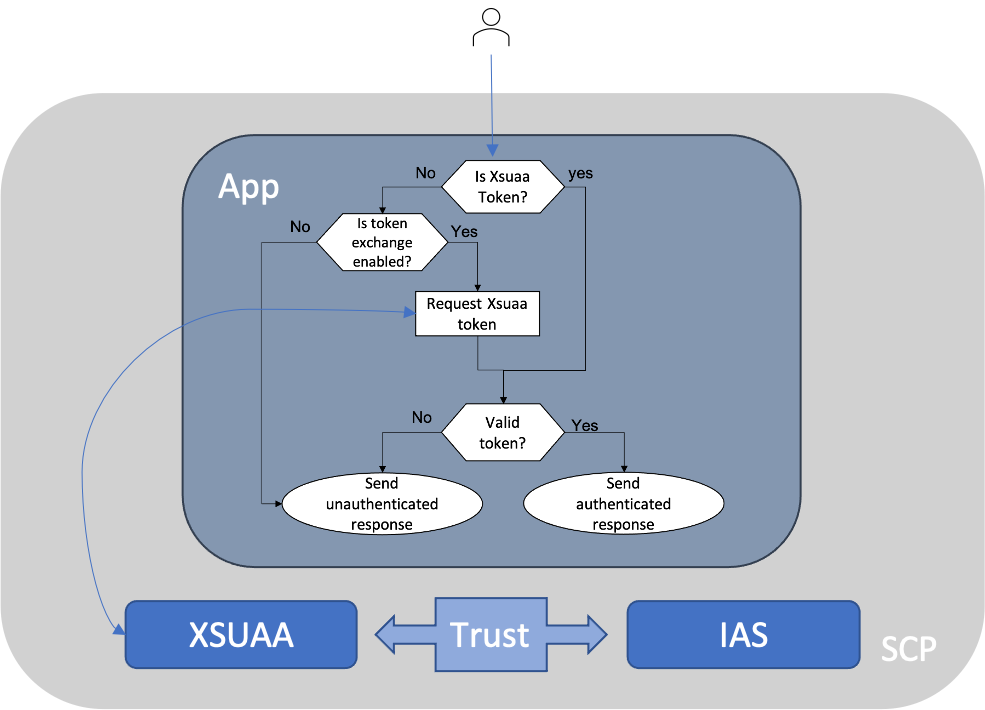

# Explore IAS compatibility with the SDK

## Status

accepted

## Context

We want to expand the scope of the SDK, so users can leverage the IAS features.
IAS, as authentication layer, cannot be used without authorization layer.

## Decision

For the time being, using IAS (authentication) and XSUAA (authorization) together (hybrid mode) is a common SAP solution.
We can delegate the token exchange task to the lib `@sap/xssec`.

In addition, we have to consider/test the scenarios like:

- when both IAS and XSUAA are enabled (for IAS users)
- when only XSUAA is enabled (for current users)
- when only IAS is enabled (error handling as this should not work)
  
  The flowchart of the token exchange.

## Background

### SAP Kernel Services

[SAP Kernel Services](https://pages.github.tools.sap/kernelservices/) are foundational services used by all LoBs to ensure consistent integration across all SAP cloud solutions.

### Identity Service

[Identity Service](https://pages.github.tools.sap/kernelservices/services/identity-service) is part of the SAP Kernel Services.
The Identity Service consists of IAS(Identity Authentication Service) and IPS(Identity Provisioning Service).

### Why Identity Service

The [roadmap](https://pages.github.tools.sap/kernelservices/services/identity-service) should give you a big picture about new features of the Identity Service.
You'll find some potential use cases below.

#### Identity provisioning

Customers using multiple cloud solutions can provision users from e.g., SAP SuccessFactors to some other non-SAP cloud solutions.
REST Services are available on the [api hub](https://api.sap.com/package/SCPIdentityServices?section=Artifacts).
User endpoint, for example, supports CRUD operations.

#### Flexible identity authentication

Customers can enable the end users, so they can choose the following authentication:

- basic auth
- 2FA auth like RSA token and/or SMS
- Microsoft Azure or other 3rd Party IdP
- on-prem IdP

#### IAS vs. XSUAA

The table below also shows some major differences between IAS and XSUAA.

|                       | IAS                                                               | XSUAA                                         |
| --------------------- | ----------------------------------------------------------------- | --------------------------------------------- |
| Standard              | [OIDC](https://openid.net) (on the top of OAuth + authentication) | [OAuth](https://oauth.net/2/) (authorization) |
| Support 3rd party IdP | yes and the SAP IdP is enabled by default                         | yes                                           |
| Runtime               | CF + Neo                                                          | CF                                            |
